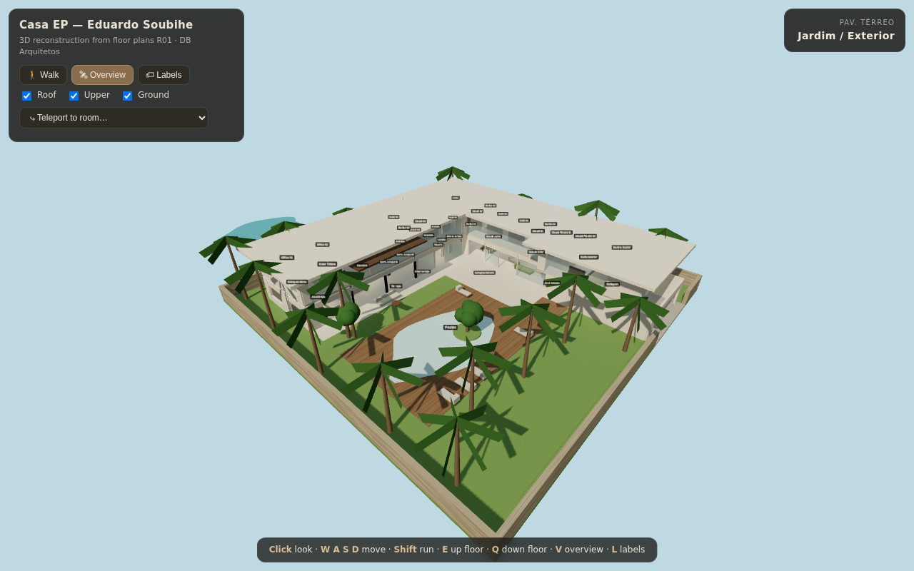
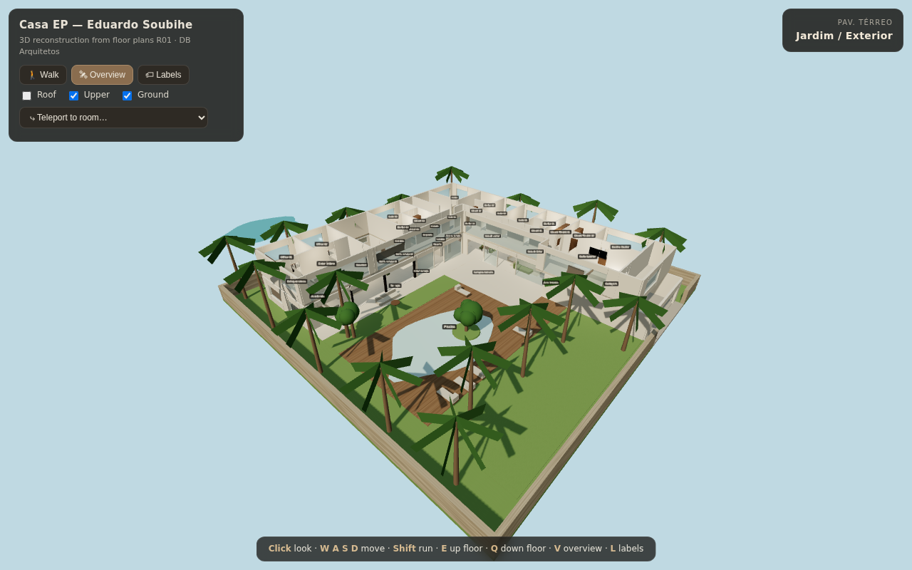
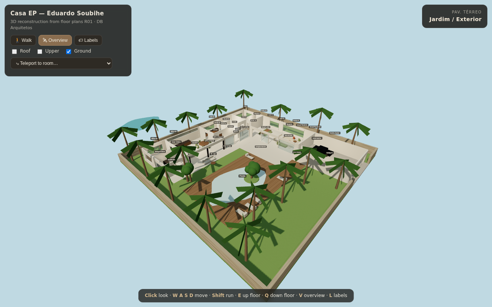
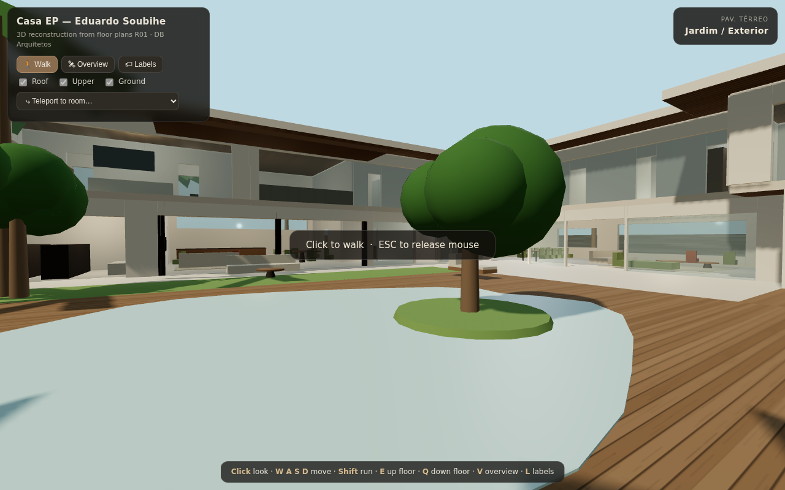

# Casa EP — 3D Walkthrough

An interactive, game-style 3D reconstruction of the **Casa EP** residence
(project by DB Arquitetos / David Bastos, presentation **R01**), built from the
floor plans on pages 2–4 of the PDF: *Pav. Térreo*, *Pav. Superior* and *Subsolo*.

## How to open it

**Easiest:** download **[`casa-ep-3d-tour.html`](casa-ep-3d-tour.html)** and
double-click it. It is fully self-contained (Three.js is embedded) and works
offline in any modern browser — no install, no server.

**Dev version:** `index.html` + `vendor/` is the same app with the library kept
as separate files. Because it uses ES-module imports it needs to be served over
HTTP (e.g. `npx http-server` in this folder), it won't open via `file://`.

## Controls

| Action | Input |
|---|---|
| Look around | Click the scene, then move the mouse (ESC releases) |
| Walk | `W` `A` `S` `D` or arrow keys |
| Run | hold `Shift` |
| Switch floor instantly | `E` (up) / `Q` (down) — or just walk the real stairs |
| Overview / dollhouse mode | `V` or the **Overview** button |
| Room name labels | `L` or the **Labels** button |
| Jump to any room | **Teleport** dropdown (grouped by floor) |
| Touch devices | left joystick = move, right joystick = look |

In **Overview** mode you can orbit/zoom the whole house and hide the roof,
upper floor or ground floor to peek inside like a dollhouse:

| Upper floor revealed | Ground floor only | First person |
|---|---|---|
|  |  |  |

## What's modeled

All rooms named on the plans, with the house's L-shaped layout around the
courtyard, pool (with its little tree island), double-height gourmet space,
walkable staircase between all three levels, deep roof overhangs and the
wood-slat / travertine / stone material palette from the architect's renders.

- **Pav. Térreo:** Gourmet (95,97 m²), Cozinha, Despensa, Depósito, Lavabo,
  Brinquedoteca, Academia, Suíte 04 + Banho, Escada, Sala de Jantar,
  Sala de Estar, Garagem, Piscina + deck
- **Pav. Superior:** Offices 01/02, Estar Íntimo, Suíte 03 + Banho/Closet, Home,
  Suítes 01/02 + Banhos/Closets, Suíte Master + Closets Master 01/02 + Banho Master
- **Subsolo:** Dormitórios + Banhos de Serviço, Estar Serviço, Área de Serviço,
  Depósitos, Garagem (3 vagas), Área Técnica

## Caveats

This is a visualization aid, not a CAD model. Room positions, adjacencies and
areas follow the plans, but wall dimensions are approximate (reconstructed from
the room areas printed on the drawings), and furniture is indicative. Use the
architect's drawings for anything dimensional.
